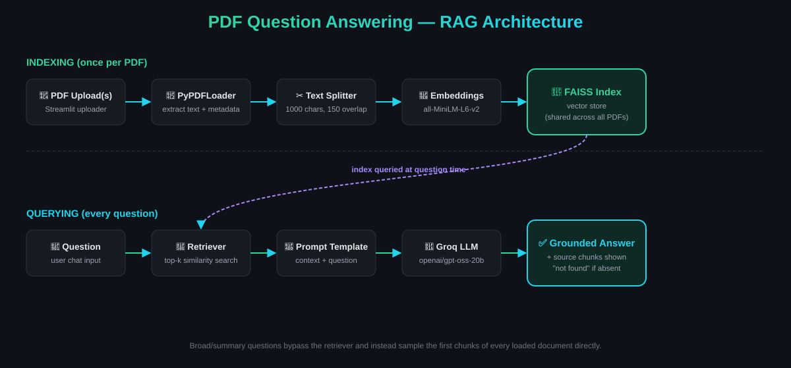

# PDF Question Answering (RAG)


Ask questions about one or more PDFs and get answers grounded in their actual content — not guesses. Built as a learning project to understand Retrieval-Augmented Generation end to end, from a bare Colab notebook to a deployed multi-document chat app.

**🔗 Live demo:** [your-streamlit-app-url-here](#)

<!-- Add a demo GIF here once recorded, e.g.: -->
<!--  -->

## Features

- Upload one or multiple PDFs and ask questions across all of them
- Answers are generated only from retrieved document content — the app explicitly says "not found" when the answer isn't present
- Multi-turn chat interface with full conversation history
- Source chunks shown for every answer, with filename and page number
- Smart handling for broad questions ("summarise this", "key points") that pulls representative content from every loaded document instead of relying on similarity search alone
- Retrieval breadth (`k`) scales with the number of loaded documents to reduce imbalance when documents vary in size

## Architecture



```
PDF(s) → Extract text → Split into chunks → Embed chunks → Store in FAISS
                                                                  |
User question → Retriever (top-k similarity search) → Relevant chunks
                                                                  |
                        Chunks + question → Prompt → LLM → Answer
```

## Tech Stack

- **LangChain** — orchestration (loaders, splitters, prompts, chains)
- **FAISS** — vector similarity search
- **HuggingFace `sentence-transformers/all-MiniLM-L6-v2`** — text embeddings
- **Groq (`openai/gpt-oss-20b`)** — LLM inference
- **Streamlit** — web UI
- **pypdf** — PDF text extraction

## How RAG Works Here

1. Each PDF is loaded and split into ~1000-character overlapping chunks
2. Every chunk is embedded into a 384-dimensional vector
3. Vectors are indexed in FAISS for fast similarity search
4. A question is embedded the same way, and FAISS returns the most similar chunks
5. Those chunks are inserted into a prompt template alongside the question
6. The LLM answers using only that context — explicitly instructed not to use outside knowledge

For broad/summary-style questions, similarity search doesn't reliably match any single chunk, so the app instead samples the first few chunks from each loaded document (in original reading order) to give every document a fair chance of being represented.

## Installation

```bash
git clone https://github.com/D-sasmita/pdf-qa-langchain.git
cd pdf-qa-langchain
python -m venv venv
source venv/bin/activate   # Windows: venv\Scripts\activate
pip install -r requirements.txt
```

## Environment Variables

Create a `.env` file in the project root:

```
GROQ_API_KEY=your_groq_api_key_here
```

Get a free key at [console.groq.com/keys](https://console.groq.com/keys).

## Running Locally

```bash
streamlit run app.py
```

Open `http://localhost:8501`, upload one or more PDFs, and start asking questions.

## Example Usage

1. Upload a research paper PDF
2. Ask: *"What optimizer was used to train the model?"* → answered from the paper's content
3. Ask: *"What is the capital of France?"* → correctly returns "information not found in the document(s)"
4. Upload a second PDF and ask a question spanning both, e.g. *"Compare the assumptions made in each document"*

## Limitations

- Works only with text-based PDFs — scanned/image-only PDFs aren't supported (no OCR)
- Retrieval is similarity-based, not exhaustive — with several large documents loaded together, less-relevant documents can still be under-represented in specific-fact answers
- No persistent storage — chat history and the vector index reset when the app restarts
- Embedding and retrieval happen in-memory; not designed for very large document collections

## Future Improvements

- OCR support for scanned PDFs (e.g. via `pytesseract`)
- Persistent vector store (e.g. Chroma with disk storage) instead of in-memory FAISS
- Per-document filtered retrieval to guarantee every loaded PDF contributes to broad/cross-document answers
- Conversation memory so follow-up questions can reference earlier turns implicitly
- Streaming responses instead of waiting for the full answer
- Automated tests for the chunking, retrieval, and error-handling logic

## License

MIT — see [LICENSE](LICENSE) for details.
